# Galaxy Image Generator

An image generator that produces GalaxyZoo-like images.

## Usage

To generate an image, execute the script as follows:
```bash
python galaxy_generator.py
```

The generation process can also be customised with a few parameters:
- **Temperature** (`-t`): The temperature used for the generation process. 
    Defaults to 1.0. <1 generates more standard images, >1 generates more varied images.
- **Number of Images** (`-n`): The number of images to generate. Defaults to 1.
- **Output File** (`-o`): The filename to call the output image(s). 
    If there are multiple images, they will be numbered with the given name.
- **Verbose** (`-v`): Flag to select whether or not to show more detailed error messages.

Example with all parameters:
```bash
python galaxy_generator.py -n 5 -t 1.5 -o "my_image.png" -v
```

## Outputs

The output images are 128x128 RGB images.
By default, they are saved as a png, but jpegs are also allowed, if specified in the output parameter.

## Architecture

The generator uses two combined models: a Vector Quantised Variational Autoencoder (VQ-VAE) and a PixelCNN.
The PixelCNN is trained on the latent space of the VQ-VAE.

The pipeline works as follows (in pseudocode):
```
latent_grid_indices <- PixelCNN.sample()
latent_vectors <- VQ-VAE.indices_to_vectors(latent_grid_indices)
image <- VQ-VAE.decode(latent_vectors)
```

### The Composite Model

The `ImageGenerator` class in `image_generator.py` loads the VQ-VAE and PixelCNN from a config file.
It has one public function, `generate_image(output_file, temperature)`, which generates and saves an image.

### VQ-VAE

- **Input/Output Dimensions**: 128x128x3
- **Latent Grid Dimensions**: 16x16
- **Latent Vector Length**: 64
- **Codebook Size**: 1024

The vector quantiser uses exponential moving average (EMA) for updates.
After training, codebook usage reached *>80%*.

### PixelCNN

- **Input/Output Channels**: 1024
- **Residual Layers**: 12
- **Filters Per Layer**: 128

## Custom Models

The codebase is extensible for custom models to be trained and used.

### Loading Models

Each model requires 3 files:
- **Config**: A JSON file with the model parameters, as well as filepaths to the other two files. An example can be found at `models/GalaxyGen.json`.
- **VQ-VAE Model**: A weights-only PyTorch model file for the VQ-VAE.
- **PixelCNN Model**: A weights-only PyTorch model file for the PixelCNN.

The `config.json` file can be passed into the `ImageGenerator` constructor, where error and consistency checks will be done.

### Training Models

The two training notebooks show how I trained my models.
Due to resource limitations, I trained the VQ-VAE separate from the PixelCNN.
This manner of training also produces a good bases for the sampling to work on top of.

All training functions are in the respective model's `model_utils.py` file.


## Examples

### Temperature = 0.5

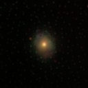 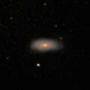 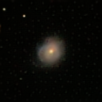

### Temperature = 1.0

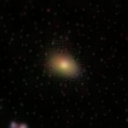 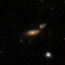 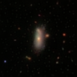

### Temperature = 1.5

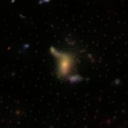 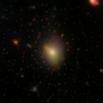 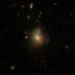

### Temperature = 2.2

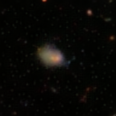 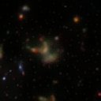 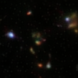